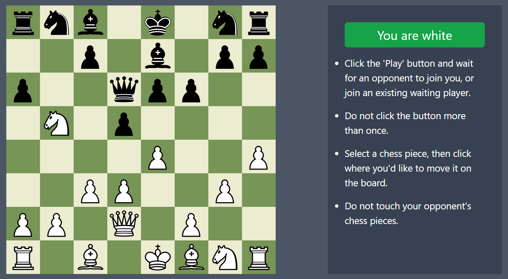

# Multiplayer Chess Game

This is a multiplayer Chess game implemented using TypeScript, React.js, Tailwind CSS, and WebSockets. Players can play against each other from anywhere, as the game supports multiplayer functionality through WebSocket communication. 

Live at: https://jakaria-chess-game.netlify.app/

## Features

- **Multiplayer Support:** Players can play against each other from different locations.
- **Multiple Games:** Supports multiple games simultaneously, allowing more than two players to play at the same time.
- **Real-time Updates:** Game updates and moves are broadcasted to all players in real-time via WebSockets.

## Screenshots

## How to Play

1. Clone or download this repository.
2. Install dependencies by running `npm install`.
3. Start the backend development server by running `npm start`.
4. Start Vite frontend server by running `npm run dev`.
5. Open two browser windows and navigate to `http://localhost:5173` to simulate two players.
6. Start playing the game by making moves and observing real-time updates.

## Technologies Used

- **TypeScript:** Used for static typing and enhanced code readability.
- **React.js:** Frontend library for building user interfaces.
- **Tailwind CSS:** Utility-first CSS framework for styling.
- **WebSockets:** Provides real-time communication between clients and server.

